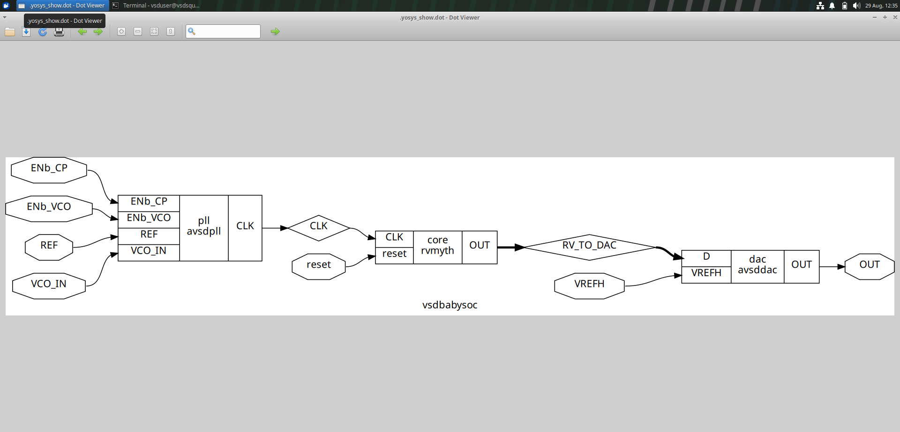
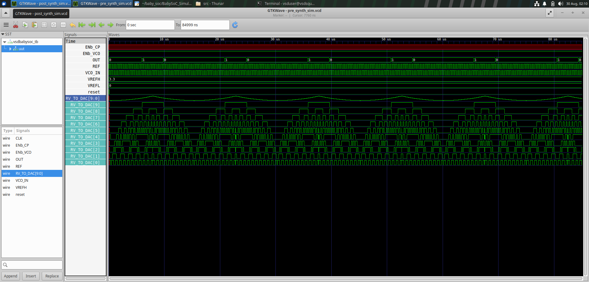
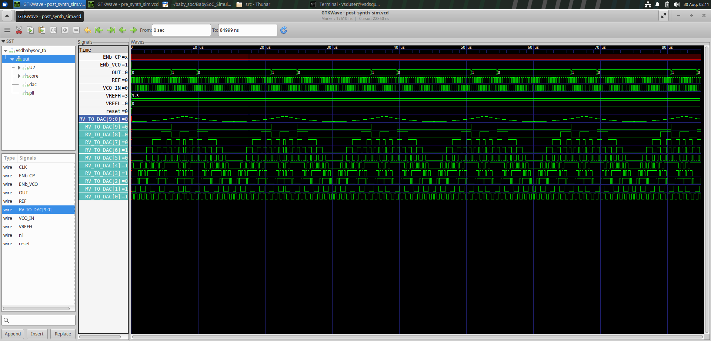
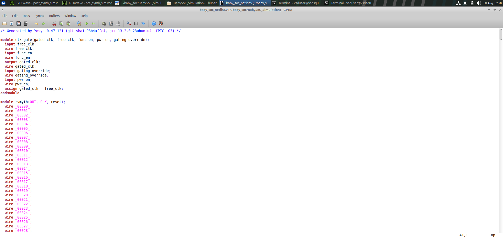

# VSDBabySoC – RTL and Gate-Level Simulation

Ran the BabySoC design (PLL → RVMYTH core → DAC) through simulation end to end — pre-synthesis (RTL) simulation, synthesis with Yosys, and gate-level simulation (GLS) on the resulting netlist.

  

## Pre-Synthesis Simulation

  

## Post-Synthesis Simulation (GLS)

  

## Synthesized Netlist

  

