# Week 2 – Logic Optimization, GLS & Synthesis-Simulation Mismatch, and Latch Inference

Week 1 covered Modules 1–2 (RTL basics, simulation, and intro to Yosys). Week 2 moves into Modules 3–5: optimizing the logic itself, verifying that a synthesized netlist still behaves like the RTL, and understanding how careless coding style creates unintended hardware like latches. As before, this is a run-through of what I actually did in the labs, not a copy of the slide definitions.

---

## 1. Module 3 – Combinational and Sequential Logic Optimization

**Combinational logic optimization** is about squeezing a design down for area and power — simplifying the logic without changing its function. The two main techniques:

- **Constant propagation** — if an input to some logic is a known constant, the tool folds that value through the expression and removes the now-redundant gates.
- **Boolean logic optimization** — minimizing the logic expression itself, conceptually the same as solving it with a **K-map** and making use of **don't-care (DC)** conditions where the output doesn't matter for certain input combinations.

**Sequential logic optimization** applies the same idea to circuits with memory elements:

- **Basic** — sequential constant propagation, where a flip-flop's output turns out to always settle to the same constant value, so it can be optimized away.
- **State optimization** — condensing/reducing redundant states in a state machine.
- **Advanced** — **cloning** (duplicating a high-fanout register to ease routing/timing) and **retiming** (shifting registers across combinational logic to balance path delays without changing overall functionality).

### Labs — Counter and DFF Constant Optimization

Ran `counter_opt` through Yosys to see state/counter optimization in action:

<p align="center">
  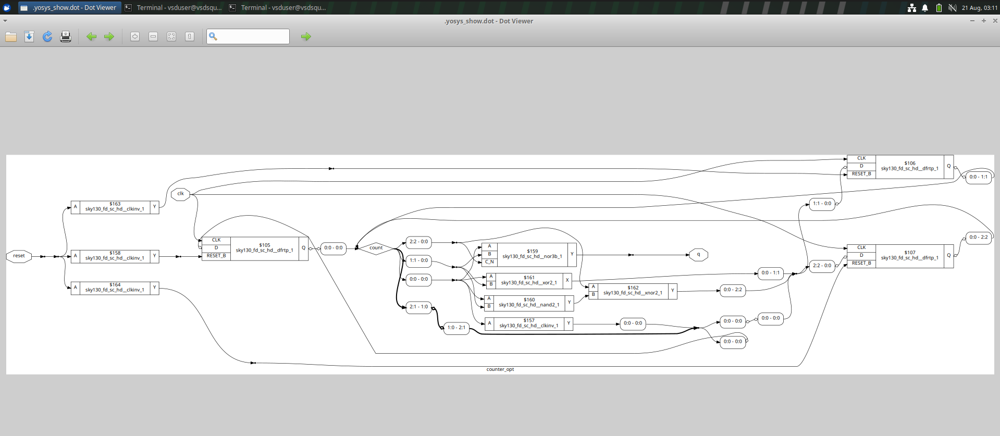
</p>

And `dff_const3` to see sequential constant optimization on a flip-flop:

<p align="center">
  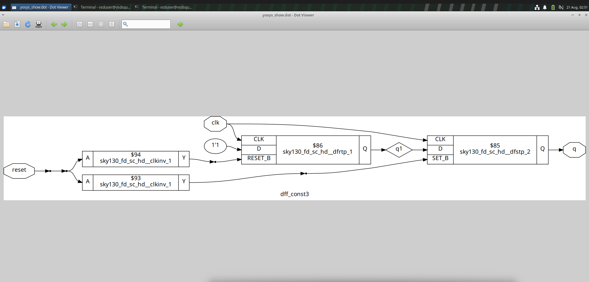
</p>

<p align="center">
  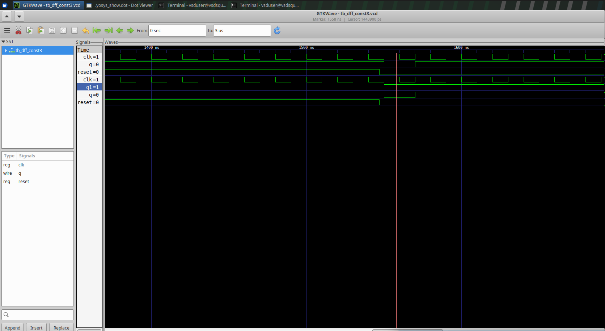
</p>

---

## 2. Module 4 – Gate-Level Simulation and Synthesis-Simulation Mismatch

**GLS (Gate-Level Simulation)** means running the testbench against the *synthesized gate-level netlist* instead of the original RTL, to check that synthesis didn't change the design's behavior. GLS can be run in two flavors depending on what you're verifying:

- **Functional / zero-delay** — checks pure logical correctness of the gate-level netlist, ignoring real timing.
- **Timing-annotated** — uses delay information (unit-delay or SDF-annotated) so the simulation also reflects real gate delays, not just logic.

A **synthesis-simulation mismatch** is when the RTL simulation and the GLS/hardware behavior disagree — usually caused by non-synthesizable or ambiguous coding style. Two common causes I worked through:

Each pair of waveforms below follows the same comparison: the first image is the **RTL simulation** (`iverilog design.v tb.v`, straight from the source), and the second is the **GLS simulation** (`iverilog <lib>/primitives.v <lib>/sky130*.v <design>_net.v tb_<design>.v` — the testbench run against the synthesized netlist plus the SKY130 gate-primitive models). Comparing the two is exactly how you catch a mismatch.

### Missing sensitivity list

The simulator only re-evaluates a combinational `always` block when a signal in its sensitivity list changes. If a signal the logic actually depends on is left out of that list, the simulator won't react to it — producing a stuck/constant output in RTL simulation that doesn't match what the synthesized gate-level netlist actually does. Demonstrated this with a `bad_mux` example (an `always` block sensitive to only some of its inputs):

<p align="center">
  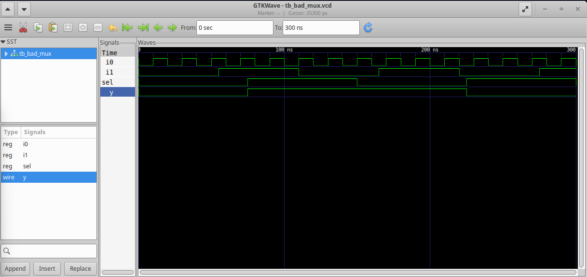
</p>

<p align="center">
  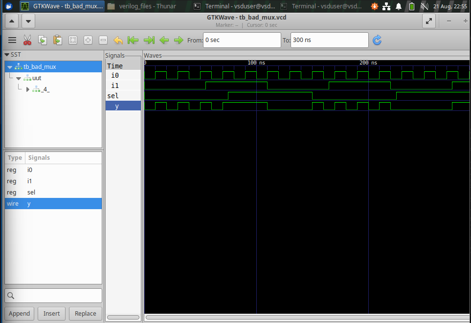
</p>

The safer alternative for a simple mux is a **ternary operator** in a continuous `assign`, which behaves like a mux in hardware and sidesteps the sensitivity-list problem entirely since there's no `always` block to misconfigure:

<p align="center">
  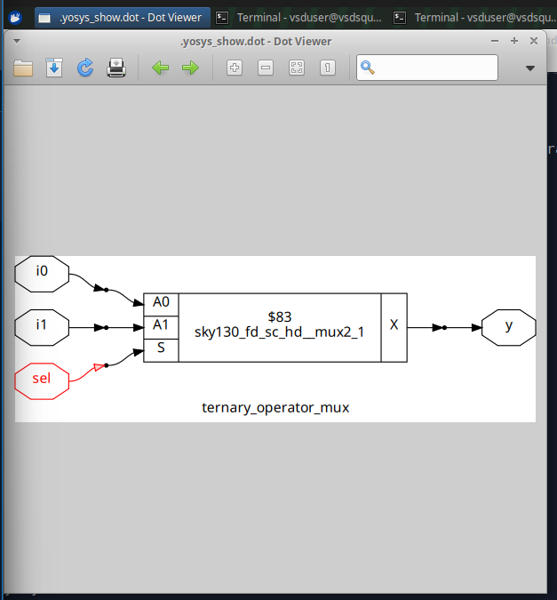
</p>

<p align="center">
  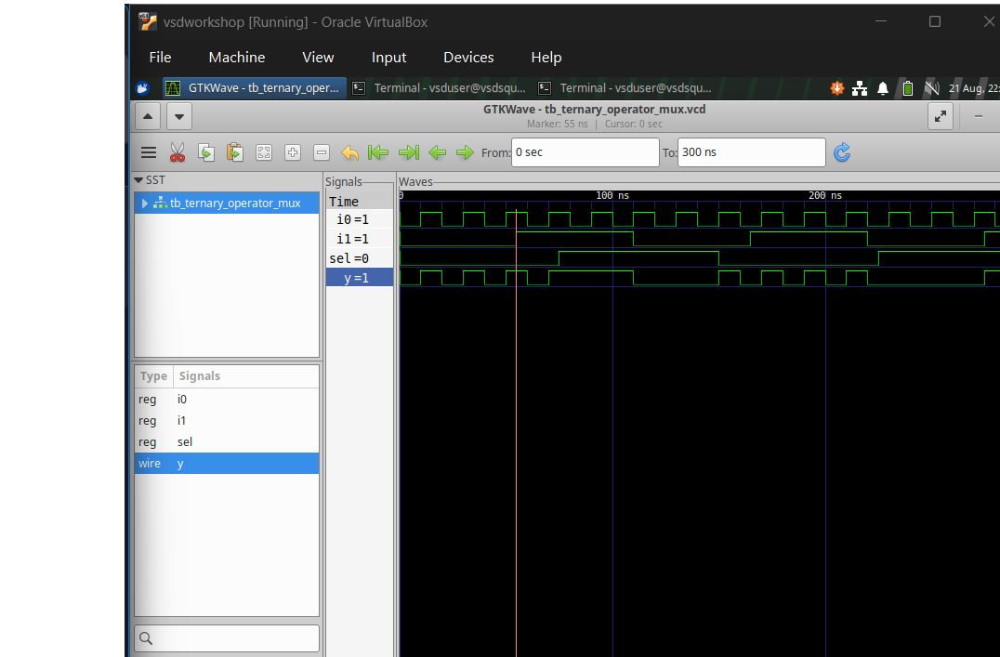
</p>

<p align="center">
  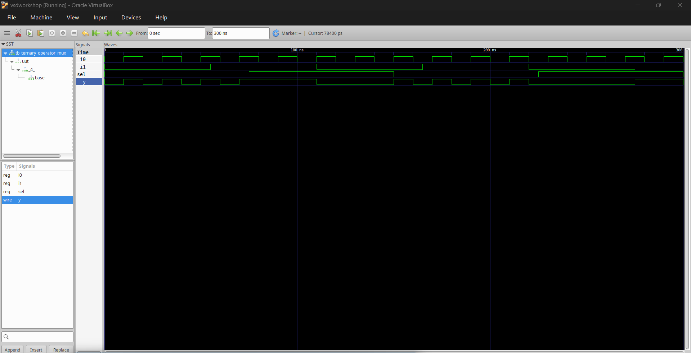
</p>

### Blocking vs. non-blocking assignments

- **Blocking (`=`)** — executes sequentially, each statement completing before the next starts. Using this inside sequential logic can create unintended dependencies between signals within the same clock edge.
- **Non-blocking (`<=`)** — all right-hand sides are evaluated first, then every assignment updates together at the end of the time step (i.e. in parallel). This is the correct choice for modeling flip-flops/sequential circuits, since real hardware registers all update on the same clock edge simultaneously.

Golden rule from this section: **always use non-blocking (`<=`) for sequential logic**, and reserve blocking (`=`) for combinational logic where order-of-execution doesn't matter.

<p align="center">
  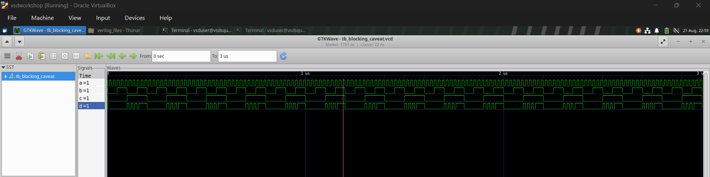
</p>

<p align="center">
  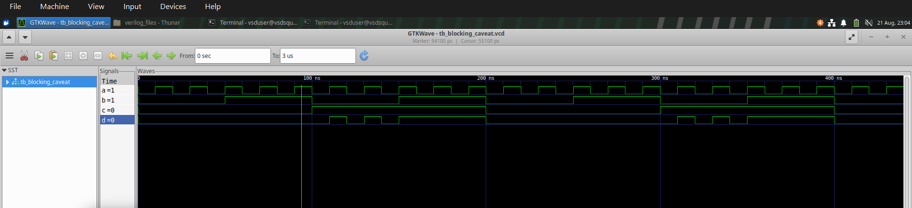
</p>

---

## 3. Module 5 – If/Case Constructs and Inferred Latches

An **inferred latch** happens when a combinational `always` block doesn't assign a value to the output on every possible path — e.g. an `if` with no `else`, or a `case` with no `default`. Since the output has nothing to update to on that path, the tool infers a latch that just holds the previous value.

- In **combinational logic**, this is almost always a bug — it creates an unintended memory element and unpredictable/glitchy behavior.
- In **sequential logic**, this same "hold the value" behavior can actually be desirable — e.g. a counter that should stay at its final count once its priority-encoded terminal condition is reached, rather than reset or roll over unexpectedly.

### Labs — Incomplete If Statements

`incomp_if` — a single `if` with no `else` infers a latch on `y`:

<p align="center">
  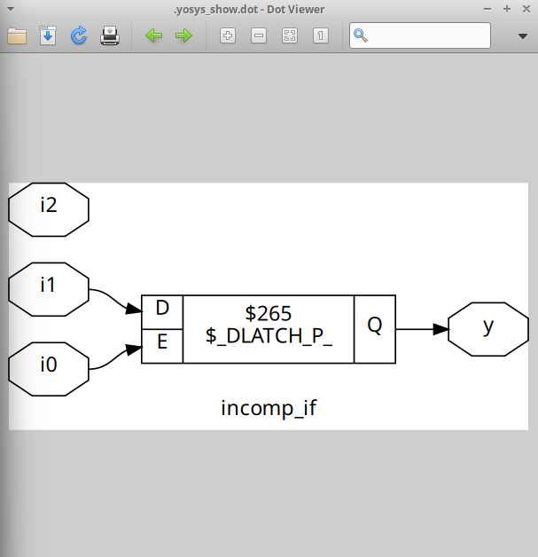
</p>

<p align="center">
  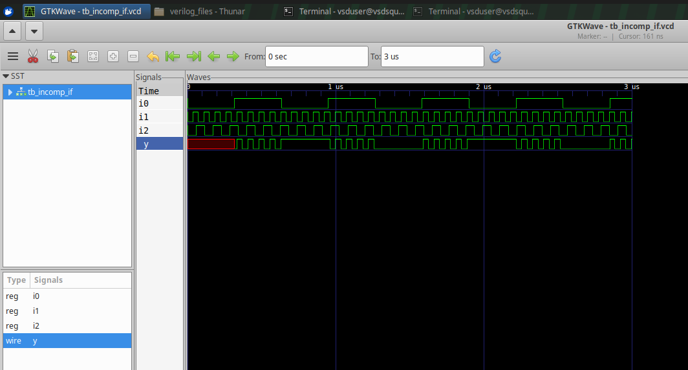
</p>

`incomp_if2` — an `if`/`else if` with no final `else` still leaves a path uncovered, again inferring a latch:

<p align="center">
  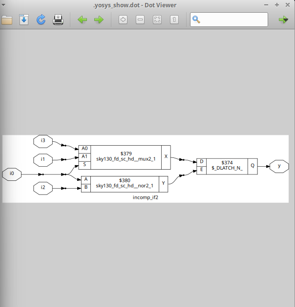
</p>

<p align="center">
  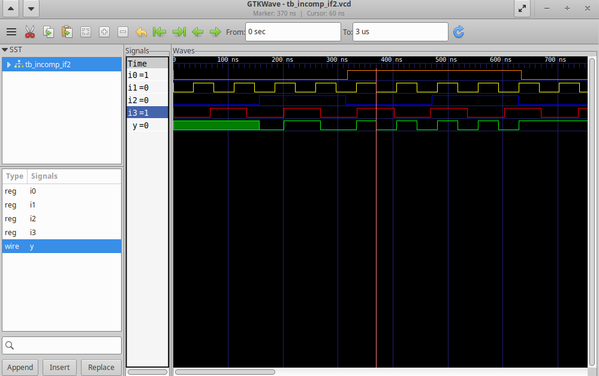
</p>

### Generate/For-Loop Based Mux, and Ripple Carry Adder (RCA)

Also worked with Verilog's `generate`/`for` constructs, which let you describe repetitive structural hardware (like a multi-input mux array) without writing out every instance by hand:

<p align="center">
  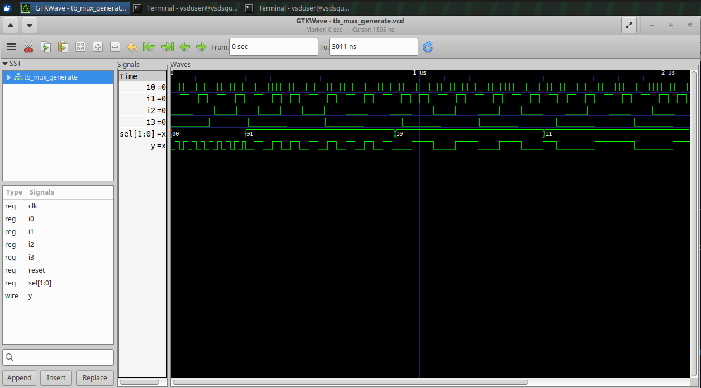
</p>

Used the same generate/structural-instantiation idea to build a **Ripple Carry Adder (RCA)** — an adder built by chaining multiple full adders together, where each stage's carry-out feeds directly into the next stage's carry-in, rippling the carry across all bits to produce the final sum:

<p align="center">
  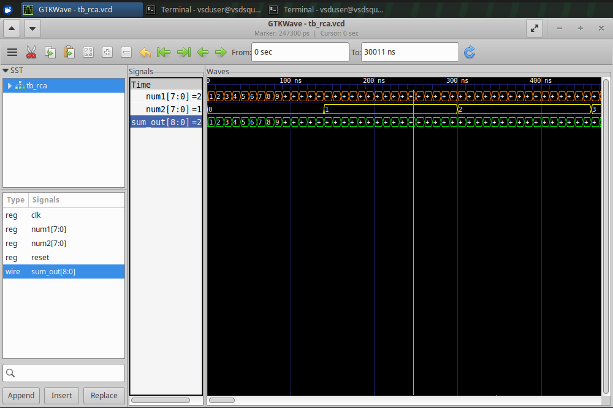
</p>

---

## 4. Overall Takeaway & Contribution

```text
Combinational/Sequential Optimization → constant prop, state opt, cloning, retiming
        ↓
Gate-Level Simulation → functional vs. timing-annotated netlist verification
        ↓
Synthesis-Simulation Mismatch → missing sensitivity list, blocking vs non-blocking
        ↓
If/Case Coding Pitfalls → inferred latches (bad in comb., sometimes useful in seq.)
        ↓
Generate/For Constructs → scalable structural hardware (mux arrays, RCA)
```

Where Week 1 was about getting the RTL-to-gate-level pipeline running end to end, Week 2 was about making sure the RTL I write actually *means* what I think it means — that the optimized, synthesized hardware matches the simulated behavior, and that sloppy coding style (missing sensitivity lists, blocking assignments in sequential logic, incomplete conditionals) doesn't silently introduce mismatches or unwanted latches.

**Contributor / Git Blame:**

| File | Author | Notes |
|---|---|---|
| All files in this folder | `Dheekshith-zER0` | Week 2 — Modules 3, 4 and 5 |

All Verilog sources, testbenches, and lab screenshots are kept in this folder as evidence of the work, alongside this README documenting what was actually learned from them.