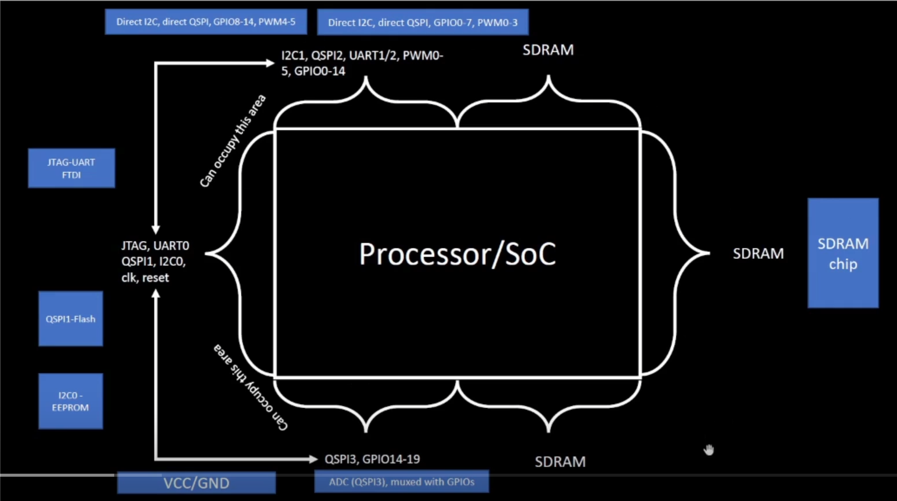
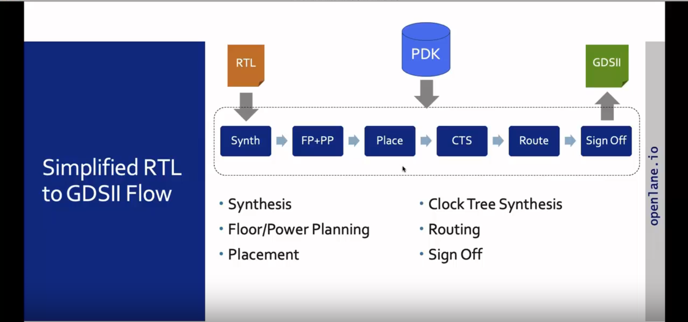
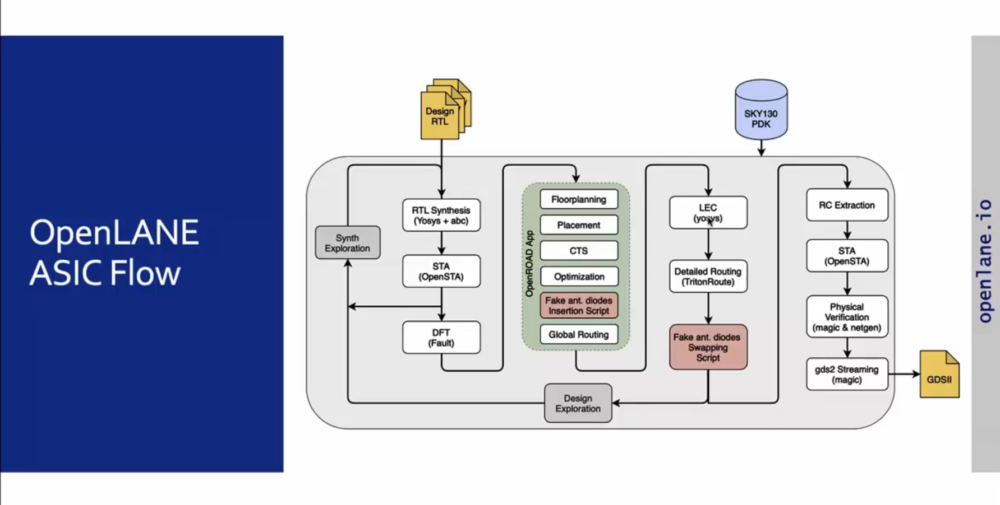
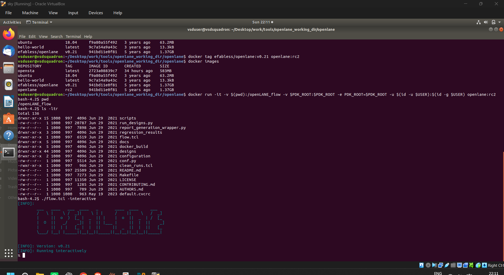

# Module 1 – Open-Source EDA, OpenLane, and the RTL-to-GDSII Flow

Week 3: from writing and verifying RTL to actually turning a design into silicon geometry. Module 1 is the conceptual groundwork before touching OpenLane hands-on — what an ASIC flow actually is, who provides the pieces (foundry, PDK, EDA tools), and the stages a design passes through from RTL to a GDSII file ready for fabrication.

---

## 1. Foundations Refresher

Started by looking at a QFN-48 package and what actually sits inside/around a chip like that, then refreshed a handful of terms I'd seen before but not in this context — RISC-V, SPI, SRAM, GPIO, ADC, DAC — as the building blocks that typically show up around a processor/SoC:

<p align="center">
  
</p>

RISC-V specifically was introduced as the example architecture we'd carry through the flow — i.e. going from an HDL description of a RISC-V core all the way to a physical layout. The specific core used for this is **PicoRV32**, a small, size-optimized RISC-V (RV32) processor core — it's a good fit for a first ASIC flow run since it's a real, practical design (instruction decoding, registers, ALU, control logic, memory interface) rather than a toy example like a counter or mux, without being so large that the flow takes forever to run.

Also connected how a software application actually reaches hardware: it goes through **system software**, which has three parts — the **OS**, the **compiler**, and the **assembler**. The compiler's output is a set of **instructions**, and that's the main thing Module 1 is really about: everything downstream (RTL, synthesis, layout) exists to eventually execute instructions on real hardware.

---

## 2. SoC Design Using OpenLane

Quick definition worth noting down: **EDA (Electronic Design Automation)** is just the umbrella term for the software tools used to design, simulate, synthesize, verify, and physically implement ICs — everything from Yosys to Magic falls under this.

The core idea: an **ASIC is built from three ingredients** — RTL (the IPs), EDA tools, and PDK data. OpenLane is the open-source flow that stitches these together to go from RTL to a manufacturable layout.

---

## 3. The Open-Source Ecosystem

Before getting into the flow itself, it's worth knowing where each ingredient actually comes from:

- **Free/open sources for RTL** — LibreCores, OpenCores, GitHub.
- **Free/open sources for EDA tools** — QFlow, OpenLane, OpenROAD.
- **PDK (Process Design Kit)** — the interface between the foundry and the designer. It's a collection of files that model the fabrication process so EDA tools can design and verify a chip for that specific process — things like standard-cell libraries, timing libraries, SPICE models, LEF/GDS files, and design-rule/DRC/LVS information.

**Foundry** — the company that actually manufactures the chip based on the physical layout the designer hands over. The foundry's process determines the transistor technology, metal layers, design rules, and standard cells available to a design. Roughly, the pipeline looks like:

```text
Chip Designer → RTL Design → EDA Flow → Physical Layout → GDSII → Foundry → Manufactured Chip
```

ASIC implementation itself is hard and complex enough that it has to be done through a defined **flow** — the structured process of going from RTL all the way to GDSII.

---

## 4. Simplified RTL-to-GDSII Flow

<p align="center">
  
</p>

- **Synthesis** — HDL is converted into a gate-level netlist using the standard-cell library provided by the PDK.
- **Floorplanning + Power Planning (FP+PP)** — lays out the die/core area and builds the power distribution network (rings, straps, rails) that keeps every cell fed with VDD/VSS.
- **Placement** — happens in two stages: **global placement** (rough, optimized positions for cells) and **detailed placement** (legalizing those positions into an actual valid, non-overlapping layout).
- **CTS (Clock Tree Synthesis)** — builds the clock distribution network so the clock reaches every flip-flop with minimal skew.
- **Route** — connects all the placed cells using the available metal layers (global routing for approximate paths, detailed routing for the actual wires and vias).
- **Sign-off** — final checks before the design is considered ready for fabrication: **physical verification** (DRC – design rule check, and LVS – layout vs. schematic, checking the layout matches the netlist), plus **via** checks and **timing verification** via STA (Static Timing Analysis, done with OpenSTA in this flow). Two terms that came up here worth remembering: **WNS (Worst Negative Slack)** — the worst slack value across all analyzed timing paths, where WNS ≥ 0 generally means the timing requirement is met — and **TNS (Total Negative Slack)** — the sum of all negative slack across every violating path, where TNS = 0 means no violations for that category.

---

## 5. What Is OpenLane

**OpenLane** is the open-source automated flow that runs all of the above — RTL in, GDSII out — by chaining together tools like Yosys (synthesis), OpenROAD (floorplanning/placement/CTS/routing), and Magic/Netgen (physical verification), among others.

Did a bit of basic research alongside this into the wider **OpenLane/OpenROAD family** and **efabless.com**, since that's where a lot of the open-source ASIC tooling and shuttle programs around OpenLane actually live — planning to dig into that further later.

One key historical point worth noting: in **2020**, **SkyWater Technology**, with help from **Google**, made the **SKY130** process available as a fully **open-source PDK** — which is what makes it possible for something like this workshop to run an entire RTL-to-GDSII flow without needing access to a commercial/NDA'd process. **SKY130** refers to SkyWater's 130nm-class process node — mature and well-documented enough to be a good learning target, even though modern commercial chips use much smaller nodes. (Still need to look into what's changed in the open-source PDK/tooling landscape between 2020 and now — noting that as a gap to fill in later.)

OpenLane can be run in two modes: **automatic** (runs the entire flow end-to-end without intervention) or **interactive** (step through the flow stage by stage, useful for debugging or learning what each step actually does) — the actual environment setup and first interactive launch are covered in Section 7 below.

---

## 6. The Full OpenLane ASIC Flow

<p align="center">
  
</p>

A few pieces worth calling out from this diagram specifically:

- **LEC (Logical Equivalence Check)**, run with Yosys, confirms that the netlist after physical steps like routing still matches the original synthesized logic.
- **Fake antenna diode insertion/swapping** — a preventive measure against the **antenna effect**, where long metal wires can accumulate charge during fabrication and damage transistor gates before the chip is fully connected. Antenna diodes are inserted (and antenna violations checked) using the open-source **Magic** tool to bleed off that charge safely.
- **RC Extraction → STA (OpenSTA)** — after routing, the real parasitic resistance/capacitance of the wires is extracted so timing can be re-checked with realistic delays, not just estimates.
- **Physical Verification (Magic & Netgen)** → **GDSII streaming (Magic)** — the final DRC/LVS checks before the design is exported as a GDSII file, the actual format handed off to the foundry.

---

## 7. Environment Setup

OpenLane itself is distributed and run via **Docker**, pulled from its GitHub repo, so before touching any actual design the first task was just getting the container environment up and confirmed working:

```bash
# tag the pulled image for convenience
docker tag efabless/openlane:v0.21 openlane:rc2

# confirm the image is there
docker images

# launch the container, mounting the flow directory and the PDK
docker run -it \
  -v $(pwd):/openLANE_flow \
  -v $PDK_ROOT:$PDK_ROOT \
  -e PDK_ROOT=$PDK_ROOT \
  -u $(id -u $USER):$(id -g $USER) \
  openlane:rc2
```

Inside the container, confirmed the mount and directory structure, then dropped into OpenLane's interactive Tcl shell to make sure the flow actually launches before running a real design through it:

```bash
pwd        # /openLANE_flow
ls -ltr    # scripts, run_designs.py, flow.tcl, docs, designs/, configuration/, Makefile, etc.
./flow.tcl -interactive
```

<p align="center">
  
</p>

| Design Stage | Tool | Main Function |
|---|---|---|
| RTL Synthesis | Yosys | RTL → gate-level netlist |
| Logic Optimization | ABC | Tech mapping to standard cells |
| Static Timing Analysis | OpenSTA | Timing checks (WNS/TNS, setup/hold) |
| Physical Design | OpenROAD | Floorplanning, placement, CTS, routing |
| Detailed Routing | TritonRoute | Final wire/via routing |
| RC Extraction | OpenRCX | Parasitic extraction |
| DRC | Magic | Design-rule checking |
| LVS | Netgen | Layout-vs-netlist checking |
| Layout Viewing | KLayout / Magic | Visual inspection |
| Final Output | — | GDSII |

---

## 8. Recap

```text
RTL (PicoRV32) → Synthesis (Yosys+ABC) → Floorplan/Power Plan → Placement
    → CTS → Routing → RC Extraction → Post-Route STA → DRC/LVS → GDSII
```

Module 1 was mostly about building the mental map before running anything for real — knowing what a foundry actually provides, what a PDK is standing in for, and why the RTL-to-GDSII flow needs to be this many distinct stages rather than one black-box step. Modules 2 and 3 of this week move into actually running PicoRV32 through OpenLane stage by stage.