# Module 2 – Good vs. Bad Floorplans, and Introduction to Library Cells

Module 2 zooms into the first real physical-design stage: floorplanning — what actually makes a floorplan "good" or "bad," what a standard cell / library cell actually is, and the physical-design concerns (power, pins, placement) that follow from a floorplan decision.

---

## 1. Core, Die, Utilization, and Aspect Ratio

```text
RTL
 ↓
Synthesis
 ↓
Floorplanning
 ↓
Power Planning
 ↓
Placement
 ↓
Clock Tree Synthesis (CTS)
 ↓
Routing
 ↓
Parasitic Extraction
 ↓
Post-Route STA
 ↓
Physical Verification
 ↓
GDSII
```

Two terms first: the **die** is the entire physical chip area, and the **core** is the inner region where the actual logic (standard cells) gets placed — the margin between the two is reserved for I/O pads and routing.

<p align="center">
  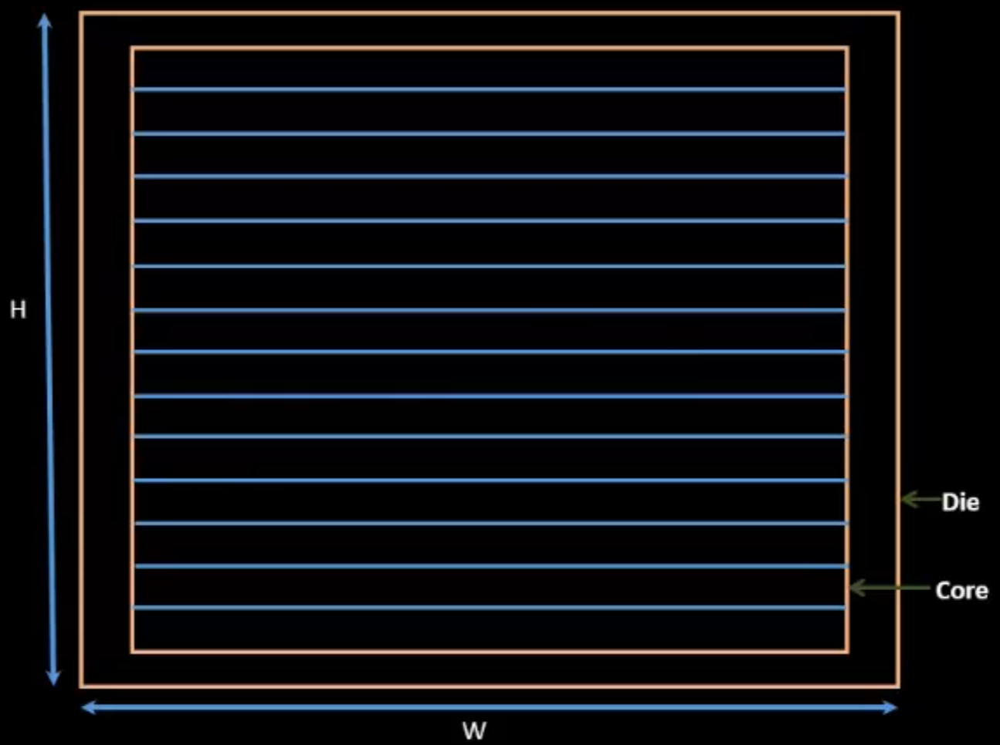
</p>

From the width and height of the core and die, two numbers fall out:

- **Utilization Factor** = Core Area ÷ Die Area
- **Aspect Ratio** = Height ÷ Width

<p align="center">
  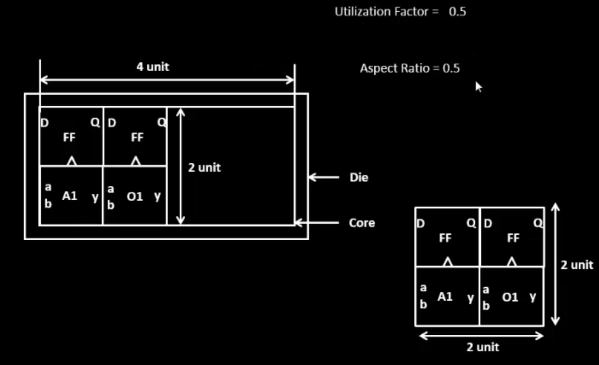
</p>

These two numbers are what actually separate a **good floorplan from a bad one**:

- **Utilization too low** — the core is mostly empty relative to the die, wasting die area (and money, since die area is expensive).
- **Utilization too high** — cells are packed too tightly, leaving no room for routing, which causes congestion and can make the design unroutable.
- **Aspect ratio far from 1** — a long, thin core makes wire lengths and routing resources uneven across the design, which hurts timing.

A good floorplan keeps utilization in a moderate, tool-recommended range and aspect ratio close to 1 (roughly square), balancing area efficiency against routability.

---

## 2. Standard Cells, IPs, and Floorplanning

A **standard cell (library cell)** is a pre-designed, pre-characterized logic block (AND, OR, inverter, flip-flop, buffer, etc.) with a fixed height and a footprint that fits into the row-based layout structure of the core.

An **IP (Intellectual Property block)** is a larger, pre-designed and verified functional block — could be a standard cell, a larger macro, or even a whole sub-design — that gets reused rather than redesigned from scratch.

**Floorplanning**, at its core, is the act of deciding the *arrangement* of these IPs (and later, the standard cells) within the core area — where each block sits, how much space it's given, and how that arrangement affects the routing and timing that follows.

A few open-source tools relevant to the routing stage that follows floorplanning: **TritonRoute** (detailed routing) and **OpenROAD's global router**, both used within the OpenLane flow.

---

## 3. Decoupling Capacitors and Noise Margin

Standard cells are typically surrounded by **decoupling capacitors (decaps)** — placed close to the cells that use them, not centralized.

Why: whenever a cell's output switches from 0 to 1 (or vice versa), it takes a nonzero amount of time to charge or discharge that node — a **charging time** — and that instantaneous switching current has to come from somewhere close by, fast, or the local supply voltage sags. A decoupling capacitor acts as a small, local charge reservoir that supplies that current immediately, rather than relying on charge traveling all the way from the main power source through resistive/inductive interconnect.

<p align="center">
  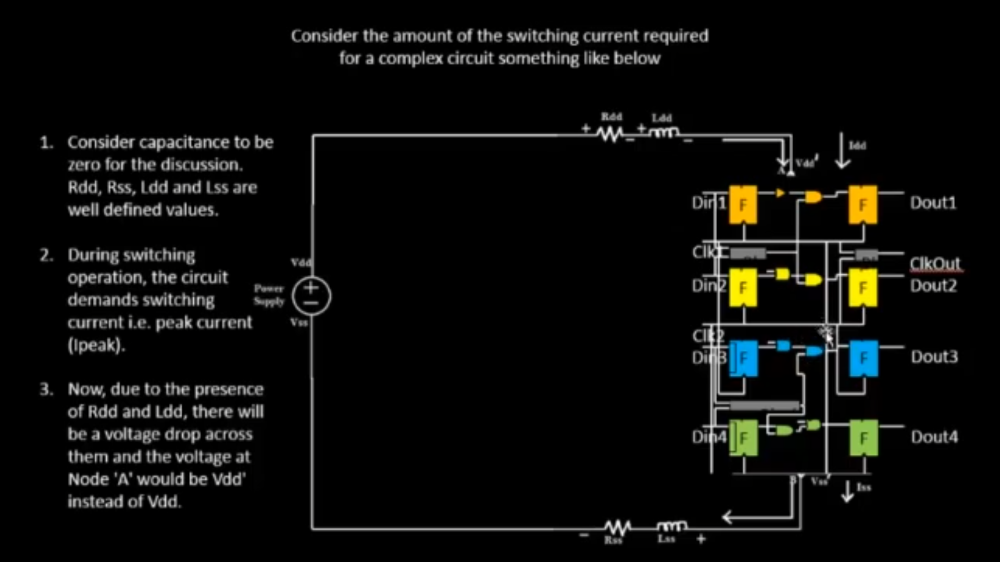
</p>

Without decaps, that voltage drop directly eats into **noise margin** — the buffer between a valid logic level and the threshold where a receiving gate might misread it. If the supply sags enough during switching, a "1" can start looking dangerously close to whatever the gate considers ambiguous, risking a functional error even though the logic itself is correct.

<p align="center">
  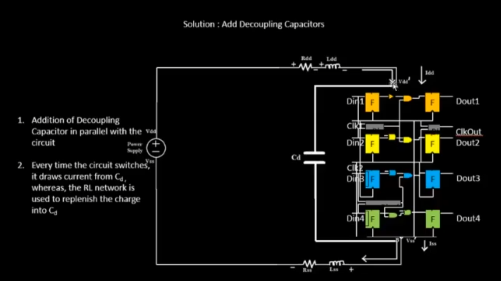
</p>

---

## 4. Power Planning: Voltage Bump, Droop, and the Power Mesh

If a design relies on a **single power source/pad**, every cell's switching current has to travel back to that one source. When a lot of cells switch simultaneously, this causes:

- **Voltage bump** — a momentary overshoot on the supply.
- **Voltage droop** — a momentary sag below the intended supply level.

Both distort the actual voltage seen by cells far from the source, again eating into noise margin and potentially causing timing or functional issues.

The solution is a **power mesh** — multiple power sources/taps distributed across the die, connected by rings and straps, so no cell is ever electrically "far" from a stable supply:

<p align="center">
  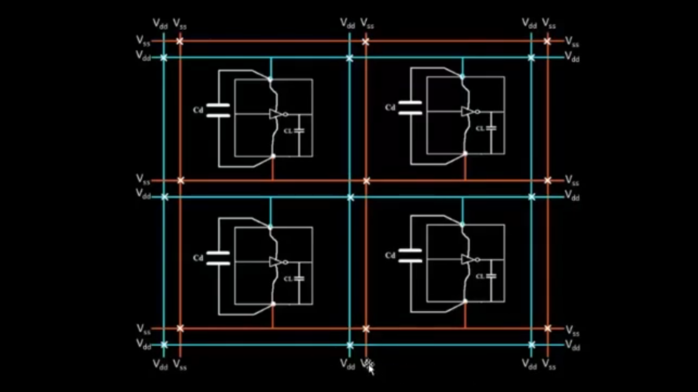
</p>

---

## 5. Pin Placement, Connectivity, and Netlist

Once the floorplan and power structure are set, **pin placement** determines where each I/O signal physically enters/exits the core, based on the **netlist's connectivity** — which internal cells each pin actually connects to. Good pin placement keeps related connections physically close, reducing the wire length (and therefore delay/congestion) that later placement and routing stages have to deal with.

---

## 6. Placement, Optimization, and Repeaters

**Placement** takes the netlist's cells and assigns them physical locations inside the core (global placement, then legalized in detailed placement). During optimization, the tool estimates **wire length and capacitance** for each net — and where a wire is long enough that its delay/capacitance would hurt timing, it inserts **repeaters (buffers)** partway along that net to restore signal strength and keep the delay manageable.

<p align="center">
  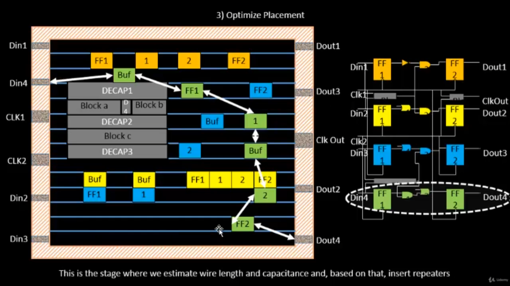
</p>

---

## 7. CTS, Routing, and STA — Why Characterization Matters

After placement comes **CTS** (building the buffered clock tree to every flip-flop with minimal skew), then **routing** (turning the estimated connections into real physical wires and vias), and finally **STA** (checking that, with real wire delays now known, every timing path still meets its constraint). All three of these stages depend on having accurate, pre-characterized timing and capacitance data for every standard cell — which is exactly why library **characterization** (Section 10) matters: without it, none of these downstream stages have trustworthy numbers to optimize against.

---

## 8. Practical Lab: OpenLane Synthesis, Floorplan, and Placement

Ran PicoRV32A through OpenLane's interactive flow — `prep -design picorv32a` followed by `run_synthesis`:

<p align="center">
  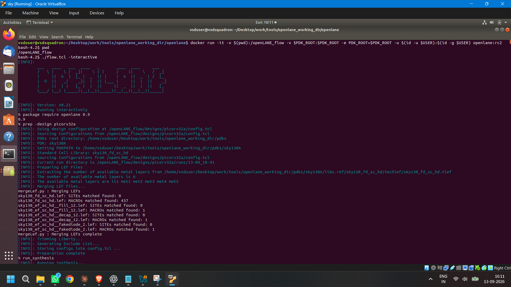
</p>

Checked the floorplan configuration variables (`FP_CORE_UTIL`, `FP_ASPECT_RATIO`, `FP_PDN_*` power grid settings) that directly control the utilization/aspect-ratio numbers from Section 1:

<p align="center">
  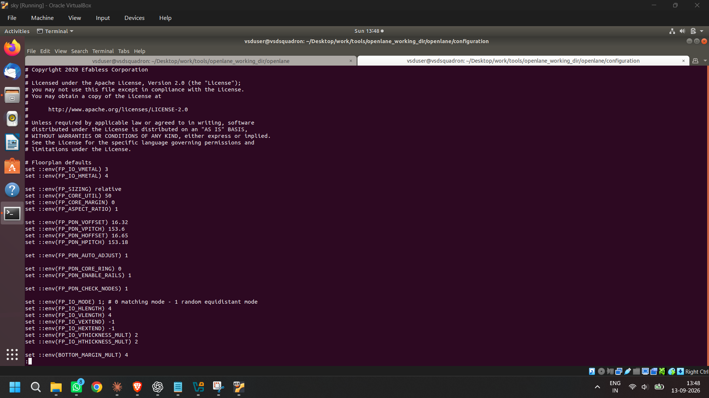
</p>

Ran the floorplan step and confirmed the pin placement log — random/equidistant pin placement based on the merged LEF and netlist connectivity:

<p align="center">
  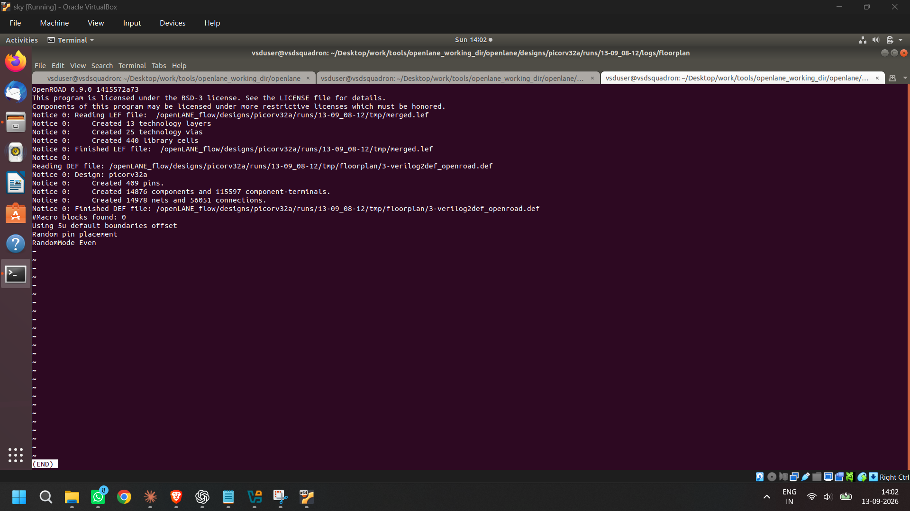
</p>

Opened the resulting floorplan in **Magic** to view the empty core rows before placement:

<p align="center">
  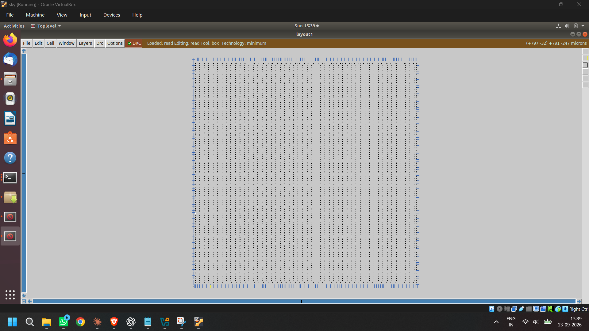
</p>

Used Magic's **S key** to select and identify individual placed library cells directly in the layout — here selecting a `sky130_fd_sc_hd__decap_3` instance to confirm decoupling capacitors are actually present in the floorplan:

<p align="center">
  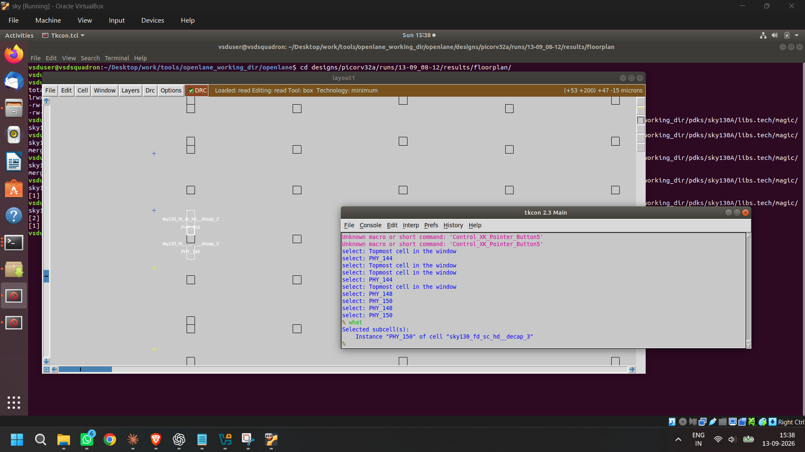
</p>

Ran placement, then reopened the layout in Magic to see the core now filled with placed standard cells:

<p align="center">
  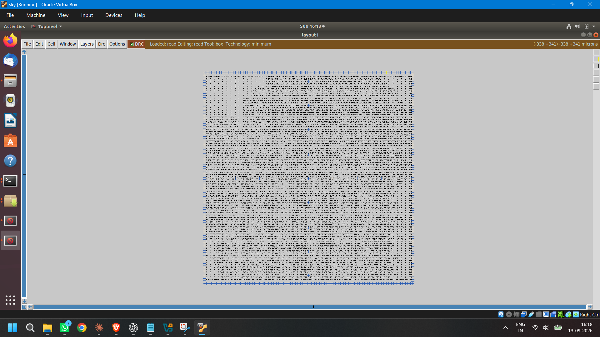
</p>

Confirmed the placement stats from the terminal — instance count, design/fixed/movable area, utilization, and HPWL (half-perimeter wire length) before/after legalization:

<p align="center">
  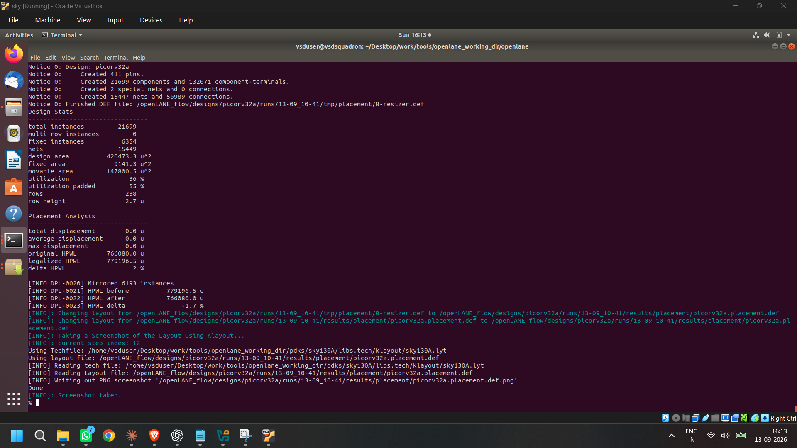
</p>

---

## 9. Cell Design Flow

A quick look at what actually goes into designing one of these library cells in the first place — inputs/outputs, internal buffers, decap blocks, and clock routing all have to be planned within the cell's own fixed boundary before it can be dropped into a larger floorplan:

<p align="center">
  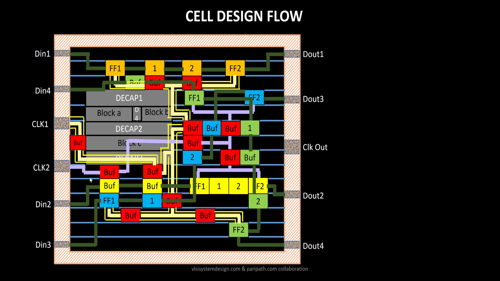
</p>

---

## 10. Characterization Flow and Timing Characterization

Before a standard cell can be used in synthesis/placement/STA at all, it has to be **characterized** — its timing (delay, transition time) and power behavior measured (typically via SPICE simulation) across different input slew and output load conditions, then stored in its `.lib` file. This is what gives synthesis and STA the accurate numbers they rely on, tying directly back to Section 7.

One piece of that characterization is measuring **transition time**, using a defined set of voltage thresholds:

<p align="center">
  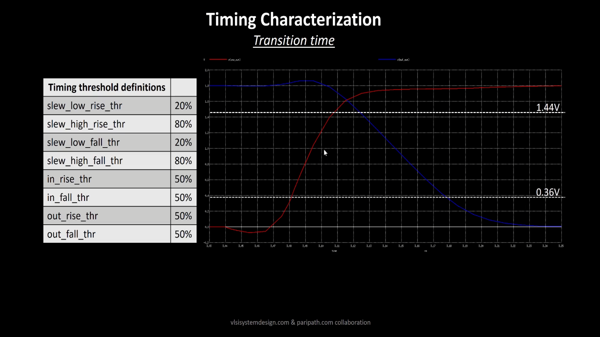
</p>

---

## 11. Summary

```text
Core/Die + Utilization/Aspect Ratio → Standard Cells/IPs → Floorplanning
    → Decoupling Capacitors & Noise Margin → Power Planning (mesh vs. single source)
    → Pin Placement (netlist connectivity) → Placement + Repeaters
    → CTS/Routing/STA → Cell Design Flow → Characterization → Timing Characterization
```

Module 2 connected the abstract "flow stages" from Module 1 to the actual physical/electrical reasoning behind them — why a floorplan's utilization and aspect ratio matter, why decoupling capacitors and a power mesh are necessary rather than optional, and how all of that traces back to individual standard cells needing to be properly characterized before any of the later stages (placement, CTS, routing, STA) can trust the numbers they're optimizing against.