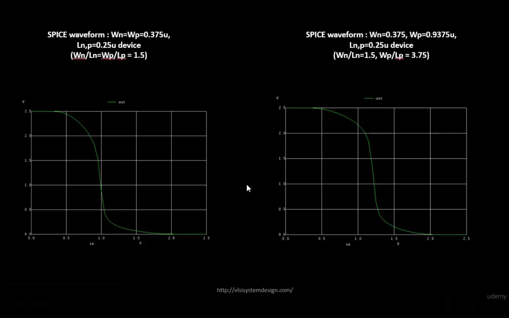
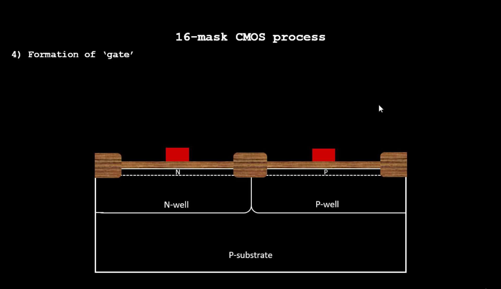
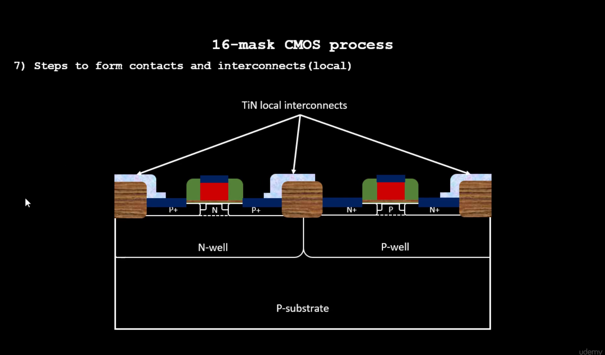
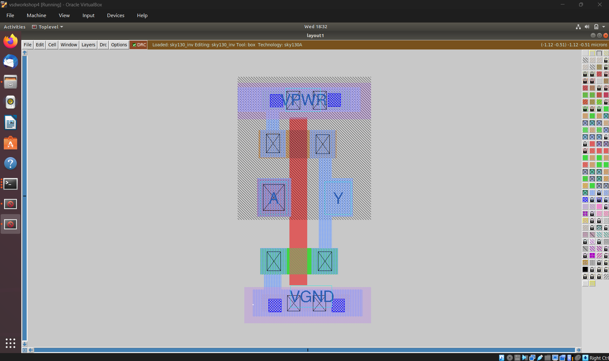

# Module 3 – Standard-Cell Characterization, Magic Layout, and ngspice

## Overview

This module connects transistor-level circuit behaviour with physical layout. The focus is on CMOS inverter characterization, SPICE simulation, CMOS fabrication, Sky130 layers, standard-cell layout, Magic, extraction, and design-rule checking.

## 1. From Circuit Behaviour to Physical Geometry

A digital standard cell is not only a Boolean function. Its physical implementation determines:

- propagation delay
- rise and fall time
- power consumption
- area
- parasitic capacitance and resistance
- manufacturability

The CMOS inverter is used as the basic example because it exposes the relationship between transistor sizing, switching threshold, delay, and noise margins.

## 2. CMOS Inverter Characterization with ngspice

The inverter can be characterized using a SPICE netlist and the Sky130 device models. Important measurements include:

- DC voltage-transfer characteristic (VTC)
- switching threshold
- propagation delay
- rise time and fall time
- transient response
- input/output loading effects

## 3. CMOS Fabrication Sequence

Physical CMOS implementation is built through a sequence of semiconductor-processing steps. At a conceptual level, the flow includes:

1. substrate and well formation
2. isolation
3. gate oxide formation
4. polysilicon gate formation
5. source/drain implantation
6. contacts
7. metal interconnect layers
8. passivation

## 4. Source, Drain, Contacts and Interconnect

After transistor formation, contacts connect diffusion and polysilicon regions to the metal stack. Interconnect layers then provide the routing required to connect devices into standard cells and larger digital blocks.

## 5. Sky130 Standard-Cell Layout

A layout represents the electrical circuit as manufacturable geometry. In a standard cell, transistor regions, wells, contacts, polysilicon and metal tracks must obey the technology rules while maintaining compatible cell height and routing interfaces.

## 6. Magic Layout Inspection

Magic is used to create and inspect layout geometry. Typical operations include:

- loading the Sky130 technology
- inspecting layers
- creating/selecting geometry
- checking connectivity
- running DRC
- extracting circuit information

## 7. Layout Extraction and SPICE

Layout extraction converts physical geometry back into an electrical representation. The extracted netlist can then be simulated to verify that the physical implementation preserves the intended circuit behaviour.

This creates the important loop:

**Schematic → Layout → Extraction → SPICE → Verification**

## 8. Technology Files and DRC

Technology files describe the layer definitions and rules understood by the layout tool. DRC checks whether the geometry satisfies manufacturing constraints such as spacing, enclosure, width, overlap and connectivity-related rules.

## 9. Practical Flow

1. Characterize the CMOS circuit with ngspice.
2. Understand the fabrication layers.
3. Inspect the Sky130 technology stack.
4. Build or inspect the standard-cell layout in Magic.
5. Run DRC.
6. Extract the layout.
7. Simulate the extracted circuit.
8. Compare extracted behaviour with the original circuit.

## Key Takeaways

- SPICE connects transistor-level behaviour to measurable timing and electrical characteristics.
- CMOS fabrication determines the physical layers used by the layout.
- Standard-cell layout translates circuit intent into manufacturable geometry.
- Magic provides layout inspection, editing, DRC and extraction capabilities.
- Extracted SPICE simulation is an important physical-verification step.

### Tools and Technologies

`Magic` · `ngspice` · `SPICE` · `Sky130 PDK` · `standard-cell layout` · `DRC` · `layout extraction`
