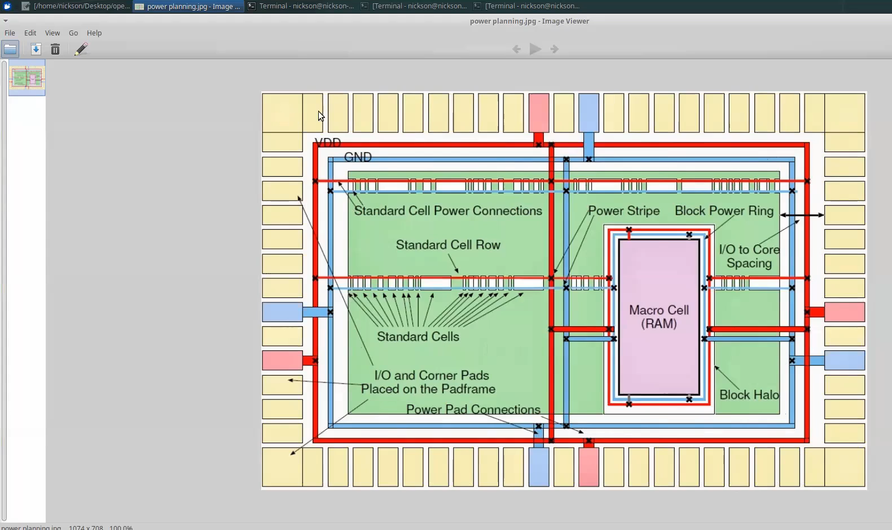
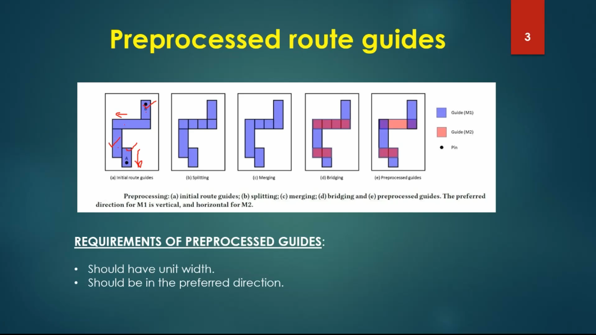
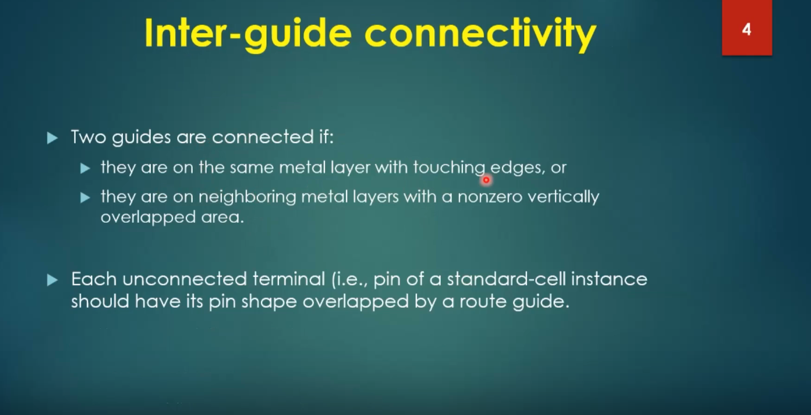
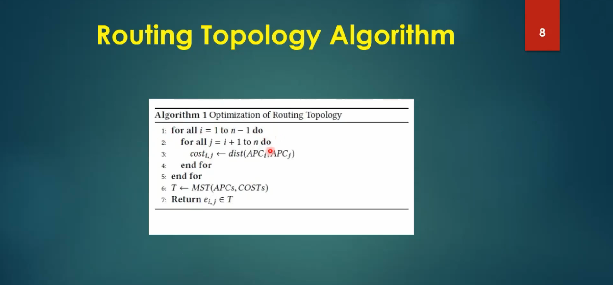

# Module 5 – Routing, DRC, and Final Physical-Design Implementation

## Overview

Routing connects the placed cells and clock network while respecting the available metal layers, routing resources and design rules. This module covers maze routing, power distribution, global and detailed routing, TritonRoute, route guides, connectivity, routing topology, DRC and post-route timing.

## 1. Where Routing Fits

The physical-design sequence can be viewed as:

**Floorplan → Placement → CTS → Routing → DRC → Extraction → Signoff**

Routing converts the placed netlist into physical metal geometries that connect pins and satisfy technology constraints.

## 2. Maze Routing and Lee's Algorithm

Maze routing searches for a legal path through a routing grid. Lee's algorithm expands a wavefront from the source until the destination is reached, then backtracks to recover the path.

The method guarantees a shortest grid path when a solution exists, although practical routers use more advanced algorithms and cost functions for scalability and optimization.

## 3. Power Distribution Network

The power distribution network (PDN) supplies stable power and ground to the design. It commonly includes:

- power rings
- straps
- rails
- cell-level power connections
- multiple metal layers

The PDN must provide connectivity while respecting width, spacing and routing-resource constraints.

## 4. Global vs Detailed Routing

**Global routing** determines approximate paths and routing regions while considering congestion and capacity.

**Detailed routing** converts those plans into exact wire and via geometries while satisfying technology-specific design rules.

The two stages work together: global routing provides guidance, while detailed routing performs the final geometric implementation.

## 5. TritonRoute

TritonRoute is a detailed-routing engine used in the OpenROAD flow. It works with routing guides generated during global routing and produces detailed metal and via geometries.

## 6. Route Guides

Route guides constrain where a net should be routed. They provide the detailed router with regions and layer information derived from the global-routing solution.

## 7. Inter-Guide Connectivity

A net can span multiple guide regions. The detailed router must maintain electrical connectivity as the route moves between these regions.

## 8. Intra-Layer and Inter-Layer Routing

Routing may remain on the same metal layer or transition between layers using vias.

Layer changes are useful for escaping congestion and connecting different routing resources, but every via and geometry must satisfy the relevant technology rules.

## 9. Routing Topology

Different routing topologies influence wirelength, congestion, timing and manufacturability. Routing algorithms therefore consider more than geometric distance when selecting paths.

## 10. Design Rule Checking

DRC verifies that the final physical geometry satisfies manufacturing rules, including:

- minimum width
- minimum spacing
- enclosure
- via constraints
- layer-specific restrictions
- connectivity-related requirements

A clean DRC is required before treating the physical implementation as manufacturably valid.

## 11. Post-Route Physical Data

After routing, parasitic effects become more significant because the actual interconnect geometry is available. Extraction can provide resistance and capacitance information for post-route analysis.

## 12. Routing and Timing

Routing directly affects timing through interconnect resistance, capacitance, coupling and wirelength. Critical nets may require:

- shorter routes
- higher routing layers
- buffering
- resizing
- topology changes

Post-route STA therefore provides a more physically representative timing picture than early idealized analysis.

## 13. Practical Flow

1. Complete floorplanning and placement.
2. Build the PDN.
3. Generate global-routing guides.
4. Inspect congestion.
5. Run detailed routing.
6. Resolve connectivity and routing-rule violations.
7. Run DRC.
8. Extract parasitics.
9. Run post-route STA.
10. Iterate until timing and physical constraints are satisfied.

## Key Takeaways

- Routing transforms placement into connected physical metal.
- Global routing plans paths; detailed routing realizes them.
- TritonRoute uses routing guides to construct detailed routes.
- PDN construction is part of physical implementation.
- Vias enable inter-layer connectivity.
- DRC validates manufacturability constraints.
- Post-route parasitics must be considered for realistic timing analysis.

### Tools and Technologies

`TritonRoute` · `OpenROAD` · `OpenLane` · `Magic` · `OpenSTA` · `Sky130 PDK` · `global routing` · `detailed routing` · `DRC` · `parasitic extraction`
